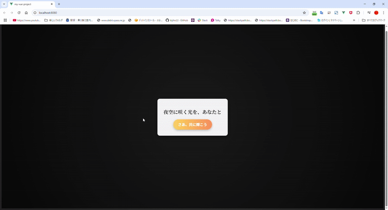
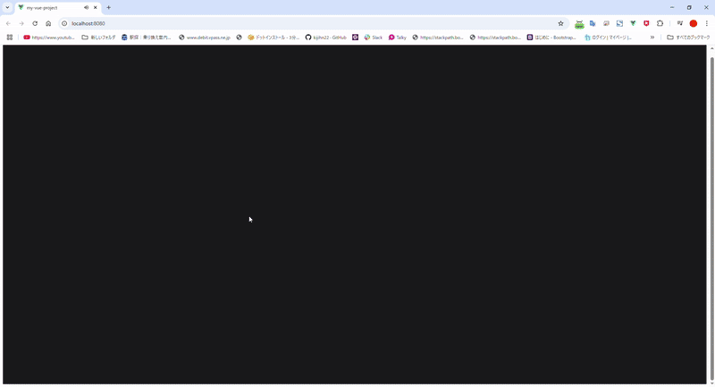
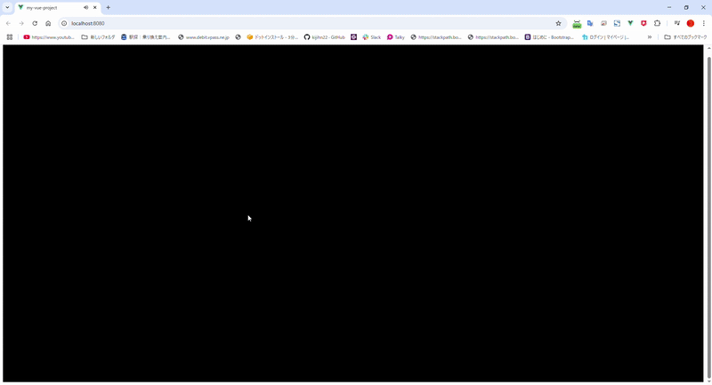
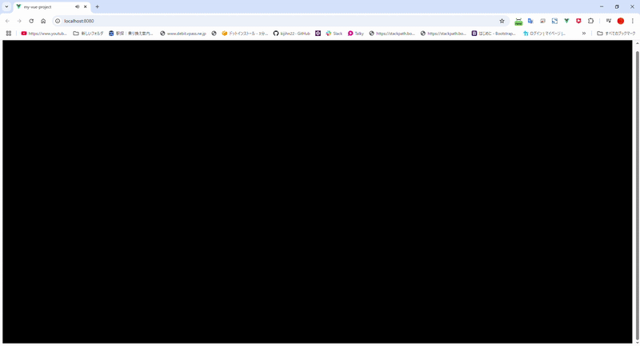

# Fireworks ストーリーボード

## シーン 1: 夜空の静寂（冒頭）
### 描写:
- 夜の湿った空気と虫の音が、日本の夏の静けさを包み込む。
- 地上から湧き上がる生命の輝きを象徴する粒子が天へ昇り始める。
- まだ全ての粒子が昇り切る前に、視点が次のシーンへと切り替わり、物語の焦点が新たに定まる。

### アニメーション:

1. **粒子の立ち昇り**:
- 地上から星々が湧き上がるように天へ昇る。
- 粒子は光を放ちながら緩やかに加速し、12秒目以降も続く動きで生命の息吹を象徴。
- 粒子が昇り切らずに次のシーンへ移行する。
2. **星々の輝き**:
- 上昇中の星々が時折輝きを増し、小さな閃光を放つ。
- 一部の粒子が上空で弾け、夜空に散り始める。
3. **シーン移行のタイミング（10秒目）:**:
- 粒子の上昇がまだ続く中、画面の焦点が一箇所に絞られる。
- フェードアウトまたはカメラのクローズアップにより、滑らかに次の花火のシーンに切り替える。
4. **サウンド**:
- 静けさを包む虫の音を背景に、上昇する粒子に合わせて柔らかなピアノの調べが始まる。

---

## シーン 2: 花火の打ち上げ（中心部）
### 描写:
- 夜空に金色の柳花火や紅の大輪、青白い閃光など多様な花火が次々に打ち上がる。
- 光の軌跡と破裂音が視線と感動を引きつける。

### アニメーション:

- 花火の動き: 高速の小花火とゆっくり開く大花火が交互に打ち上がる。
- 爆発エフェクト: 半径300px程度で鮮やかに広がり、約2秒で消失。
- サウンド: 花火の破裂音が力強く響き、背景には祭り囃子のリズムが追加。

---

## シーン 3: 夏祭りの情景（余韻）
### 描写:
- けたたましい虫の音が、夏の名残を伝えるように響き渡る中、背景にはもやがかかり、薄ぼんやりとした静かな夜の情景。
- 15〜16秒かけて、虫の音が次第に薄れ、川のせせらぎが聞こえ始める。
- 川音の奥から、祭りの子供の声や笑い声が時折混じり、次第に温かみを感じさせる。
- 背景がゆっくりともやを抜け、祭りの男女が見え始める。

### アニメーション:

1. **背景のもやの変化**:
- 最初の15秒間、背景がもやで覆われている。
- 徐々にもやが薄れ、夜店や祭りの風景がぼんやり浮かび上がる。
- 約16秒目には、祭りの男女が明確に見える状態になる。
2. **サウンドの移り変わり**:
- **虫の音（冒頭〜15秒）**: 力強く響き、夏の余韻を演出。
- **川のせせらぎ（約10〜16秒）**: 静かにフェードインし、虫の音をゆっくりと置き換える。
- **祭りの子供の声（約12秒〜）**: 川音に混じり、遠くから明るい笑い声が響く。
- **全体の調和**: 祭りの声が鮮明になる頃、虫の音と川音は背景として控えめに残る。
3. **視点の切り替え**:
- 粒子アニメーションの動きが完全に収束し、画面が一箇所に焦点を当てるように遷移。
- もやの消失とともに、祭りの背景がクリアに表示。
4. **サウンド**:
- 初めはけたたましい虫の音が支配的に。
- 次第に川のせせらぎが静かに加わり、虫の音が控えめに。
- 奥から響く子供の声が明るさを加え、最終的に祭りの活気を引き立てる。

---

## シーン 4: メッセージの浮上（締めくくり）
### 描写:
- メッセージが画面中央にゆっくりと現れ、ピアノの旋律に合わせて消えていく。
- 「夜空に咲いた一瞬の光が、心に暖かい記憶を刻みますように。」といった言葉が際立ち、一つひとつのメッセージが深く印象に残る。

### アニメーション:

1. **メッセージの表示**:
- メッセージは約5秒かけて徐々に明るさを増しながら中央に浮かび上がる。
- 表示中は動きを持たず、文字の静けさを強調。
2. **ピアノの音に合わせた消失**:
- ピアノの旋律の最後の音にぴったり合わせて、メッセージが一瞬で消える。
- 消失時に残像や余韻をあえて残さず、次のメッセージを期待させる演出。
3. **次のメッセージの切り替え**:
- 前のメッセージが消えた1秒後、次のメッセージが同じように5秒かけて現れる。
- 全体で3つのメッセージがこのリズムで表示されていく。
4. **サウンド**:
- ピアノの旋律がメッセージの表示と消失に合わせて微妙にテンポを調整。
- 音楽の穏やかな進行がメッセージの緩やかな浮上と急な消失に調和し、視覚と聴覚の一体感を高める。

---

